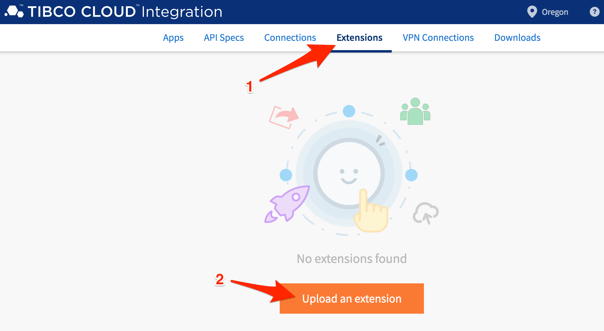

# SensorTag Connectivity
## Overview

The TI SensorTag CC3200 is jam packed with sensors<br>

<br>
For this workshop, all the data is sent to TIBCO Cloud Messaging over a secure websocket connection.  Each sensor is pumping out data once per second, tagged with its unique id (key).<br>
<br>
> For those looking for more details on how data is pulled off the SensorTag, check out this [page](polling.md).


```json
{
    "key":"value",
    "temperature":"value",
    "humidity":"value",
    "pressure":"value",
    "gyro_x":"value",
    "gyro_y":"value",
    "gyro_z":"value",
    "accel_x":"value",
    "accel_y":"value",
    "accel_z":"value",
    "light":"value",
    "mag_x":"value",
    "mag_y":"value",
    "mag_z":"value",
    "uptime":"value"
}
```
<br>
In this hands-on lab, you will import an existing TIBCO Cloud application that connects to the TIBCO Cloud Messaging service and filter on your SensorTag data.

## Get Started

Sign into TIBCO Cloud and open Extensions.  There are many ways to navigate to Extensions, but let's start with this:

1) Start at Welcome to your TIBCO Cloud
2) Select Integration
3) Select Flogo

## Load Pre-requisite External Extension Dependency

Before you import the application, we need to first import an external extension.  Once an extension is imported, it is available for all future applications.

1. Select **Extensions**
2. Select **Upload an extension** and paste into **Git repository URL**:<br>
   `github.com/project-flogo/contrib/activity/counter`<br>
  And select **Import** and then **Done**



  

## Import Application

We are going to use a prebuilt application for this hands-on lab and modify it to filter on your SensorTag data.

1) Select **Apps**
1) Select **Create**
2) Give your new app a name, **UBIoT**, and select Create.
3) Select **Create a TIBCO Flogo App**
4) Select **+ Import app**
5) Navigate to where you downloaded the app artifact and choose or drag **[CC3200v2.json](https://raw.githubusercontent.com/wkarasz/BuffaloIoT/master/workshopfiles/CC3200v2.json)** (tip: ctrl+click and save file) into upload files and select Upload
6) Press continue when you get the warning dialog for passwords
7) You are now ready to reconfigure this App with your SensorTag filter key
 
In screenshots, the steps above:


### Configure the Application
--------

#### Edit the TCM Connector

The import automatically created the TIBCO Cloud Messaging (TCM) connector, however, the authentication key must be entered.

1) Select **Connections**
2) Select **TIBCO Cloud Messaging - SensorTag** and then **Edit**
3) Update the authentication key with the following value:
  <br>`84a1916b84e22b4d7a6ea75a3ed24936`
4) Select **Save**


#### Filter To Your SensorTag Data

You'll open up the application and modify the logic to filter on your SensorTag.  A branch condition is used to process only tag data that matches the specified SensorTag key ID.

1) Select **Apps**
2) Select app **UBIoT**
3) Select flow **SensorRx**
4) Select branch transition and gear icon
5) Update **condition** to value of your SensorTag key ID


### Test the Application
--------

TIBCO Cloud enables you to unit test each application flow you develop.  The built-in tester enables you to create, configure, and reuse Launch Configurations to accelerate debugging of your application.


Drop in the following payload for the $flowInputs/stringValue:

```json
'{"key":"0", "accel_x": "0.02","accel_y": "0.03","accel_z": "0.95","gyro_x": "-0.58","gyro_y": "0.74","gyro_z": "-0.51","humidity": "67.85","light": "0.00","mag_x": "-613","mag_y": "1160","mag_z": "-613","pressure": "1000.40","temperature": "23.69","uptime": "13255"}'
```

Be sure to update the **key** with your SensorTag ID.


Click **Next** and **Run** to try out your application.  If all is good, your output should look like the following:


## Ready, Set, PUSH

If your application successfully executed in the prior step, then you are ready to Push the application into runtime mode.

Click on the **Push app**, give it a moment, and the application screen will switch to launching your application


### Review the Realtime Logs
--------

With the SensorTag continuously producing data, you can now go back and look at the realtime logs associated with your application.

Click back into the application and click on Log.


### Scale the Application
--------

Ready to cool things off or want to ramp up for more activity, scale it with a click.


## Summary

In this lab you successfully demonstrated connecting to an IoT sensor and retrieving its data published to TIBCO Cloud Messaging service.  You did this by filtering only data that matched your SensorTag ID by using the conditional branching functionality.

## Let's Move On
In the next lab, you'll focus on creating a decision table to create rules on how to process the SensorTag data. 

[--- next lab ---](rulestable.md)
