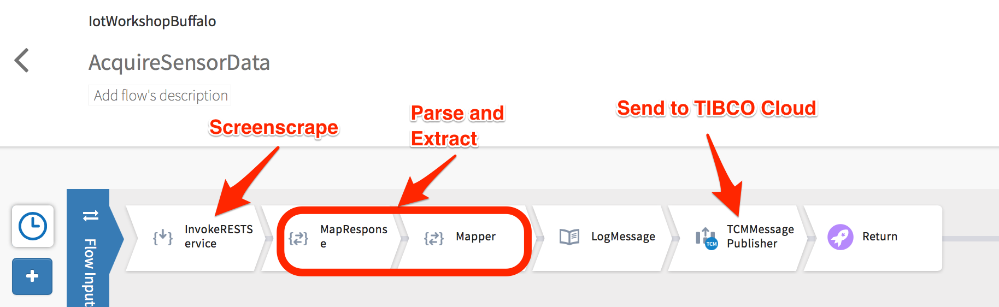

# Polling for SensorTag Data

The CC3200 SensorTag has a built-in webserver which displays various bits of useful information.<br>Props to wtremmel and the repo, [https://github.com/wtremmel/wifi-sensortag](https://github.com/wtremmel/wifi-sensortag) for documenting the various pages available.

For this workshop, we're specifically polling for data from /param_sensortag_poll.html.  The page source will look something like below:
```html
<html>
<body>
<p id="tmp">07DC 0BD8 15.72 23.69</p>
<p id="hum">A290 630C 63.50 23.84</p>
<p id="bar">59E640 7EF500 24.28 1020.21</p>
<p id="gyr">FFA8 005B FFB1 -0.67 0.69 -0.60</p>
<p id="acc">FC5F FF5B EF65 -0.23 -0.04 -1.04</p>
<p id="opt">051D 13.09</p>
<p id="mag">FDF2 0041 F9BA -526 65 -1606</p>
<p id="key">0</p>
<p id="syn">176</p>
</body>
</html>
```

The workshop uses a SensorTag->Gateway->Cloud model; i.e. The SensorTag and a gateway device such as a RaspberryPi or other computer are on the same network.  The gateway computer is responsible for polling one or more SensorTags and relaying the information to the cloud.

The following Flogo Enterprise application,[IoTWorkshopBuffalo.json](../workshopfiles/IoTWorkshopBuffalo.json), polls param_sensortag_poll.html once a second and shoots off the data to TIBCO Cloud Messaging service.  The flow is specifically made simple so that complex processing and computations can be performed in the cloud.



To use this application in your environment, you'll need to **update the TCM connector with your configuration details**.  Otherwise, compile the application for your target architecture and launch from the command line, providing your FLOGO application properties.

```
FLOGO_APP_PROPS_OVERRIDE="Sensor.URL=http://192.168.1.24/param_sensortag_poll.html,Sensor.ID=XXX" nohup ./IoTWorkshop-linux-arm > /dev/null 2>&1 &
```

> TIP: To compile a Flogo Enterprise application for a RaspberryPi, export the application json and use the *builder* utility in your Flogo Enterprise **bin** directory.  Use the GOARM environment variable as part of the build command.
>
> e.g. Where Flogo Enterprise has been installed on a Mac, use **builder-darwin_amd64**:
>
> GOARM=7 ./builder-darwin_amd64 build -f ~/Downloads/IoTWorkshop.json -p linux/arm -o ~/Downloads/IoTWorkshop


