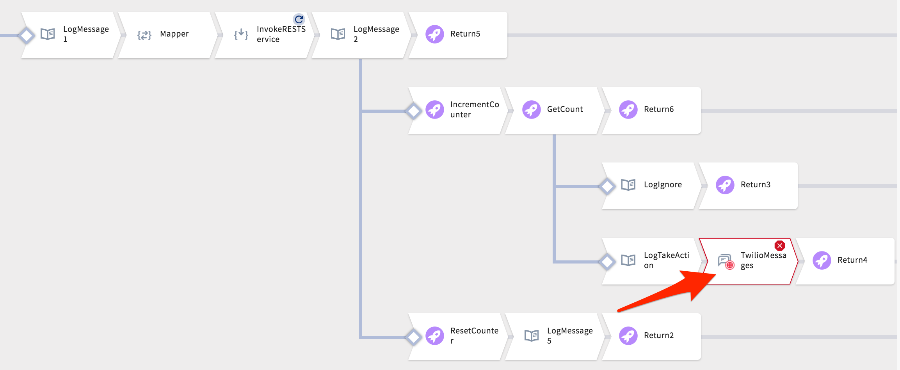
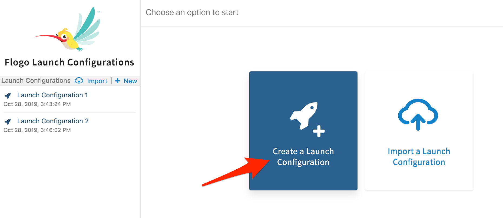
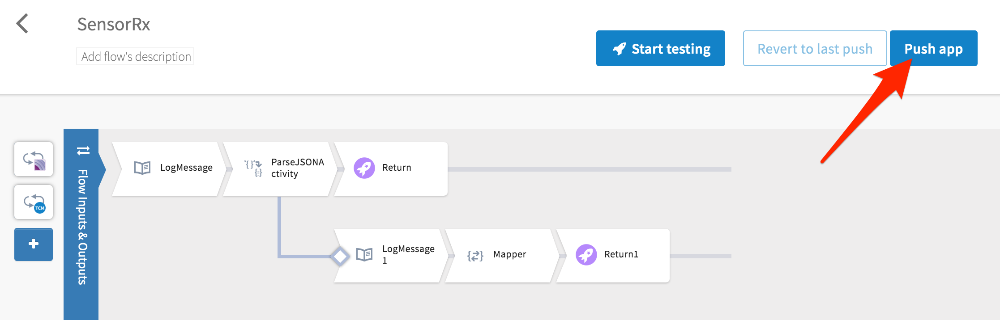

# Add Event Handler for Multiple Action Requests

## Overview

In this hands-on lab, you will add SMS notification to your **UBIoT** app.  You'll learn how to implement a handler so that an SMS notification is fired only once until the condition is cleared.  

## Get Started

Start by signing into TIBCO Cloud and open Flogo.

1. Start at Welcome to your TIBCO Cloud
2. Select Integration
3. Select Flogo

## Event Handler

In this exercise, we'll use the **Counter** activity in the **UBIoT** app.  It will be used to keep track of how many times an action has been taken and determine the application flow.

1) Select **Apps**
2) Select and open **UBIoT**
3) Select **SensorRx** flow

Take a look at the flow pathways and the branching conditions.  In the first branching activity, the application is using results returned from the TCE SensorTagDT Decision Table.  In the second branching activity (when AlertLevel=WARNING), a global Counter variable within the Flogo application is used.


The followings rules are in effect in this application:

1. IF AlertLevel=WARNING, increment the counter
	1. When Count=1, execute activities
	2. When Count>1, ignore and stop processing
2. IF AlertLevel=OK, reset the counter to zero

## Add SMS Notification

In this exercise, you are going to add SMS notification to the flow.  We only want the SMS notification to be called once, so you will add the activity to the appropriate branch of the flow.

1. Hover your mouse over the gray line and select the **+** to add a new activity.
2. From Add Activity, scroll down, select **Twilio**, and select **Twilio Messages**.
3. Close the Twilio dialog
4. Drag the **TwilioMessages** block on top of **Return4**. 




## Configure Twilio Connector

Before proceeding, we need to take a moment to add and configure the Twilio connector.  

1. Select **Connections**, then **+ Add Connection**
2. Select **Twilio** Connector
3. Update connector details
	- Connection Name: Twilio
	- Account SID: `ACf3cb8b4c733657bb1d6dc2f6e28a7a6f`
	- Auth Token: `6e4f1cd0809a0fabec8eaef377e091f` (expired)
	- 2c67517a8ccec262b52f60bc51e1e30a


## Configure Twilio SMS Send Notification

In this penultimate exercise, the SMS activity is configured to use outputed values from SensorTagDT decision table.

1. Select **Apps**
2. Select **UBIoT** app, select **SensorRx** flow
3. Select **TwilioMessages** activity block
4. Configure TwilioMessages activity
	1. **Settings** tab
		- Connection: **Twilio**
		- Action: **Send Message**
	2. **Input** tab
		- From: `"+18432039907"`
		- Body: `string.concat("Hi ", $activity[InvokeRESTService].responseBody.NotifyPerson, ". ", $activity[InvokeRESTService].responseBody.Message)`
		- To: `$activity[InvokeRESTService].responseBody.NotifyCellNumber`

## Test and Re-deploy the Application

In this last exercise, use the built-in tester and verify your application follows down each branch path.




Try the following payloads mapped to $flowInputs/stringValue:

Trigger "WARNING"
```json
'{"key":"0", "light": "0.00","temperature": "17"}'
```

Trigger "OK"
```json
'{"key":"0", "light": "0.00","temperature": "10"}'
```

Trigger "OK"
```json
'{"key":"0", "light": "20.00","temperature": "10"}'
```

Recall, SensorTagDT is defined like so:


If your application successfully executed in the prior step, then you are ready to re-deploy the application.

Click on the **Push app**, give it a moment, and the application screen will switch to launching your application



## Summary

In this lab you successfully demonstrated how to limit repeat requests to only triggering an SMS notification just once.  You did this by using conditional branching activities to route responses.  You verified that the SMS notification counter reset when the Decision Table status reverted back to "OK".

## Let's Move On

Congratulations.  This is the formal end of the workshop, but we have a challenge project for those daring to test their hacking skills.  Ready for the challenge project?

[--- challenge project ---](challenge_project.md)  
