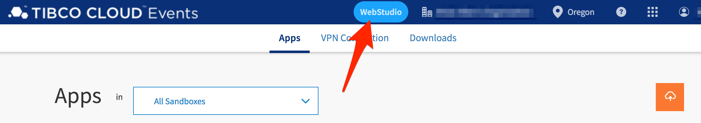

# Apply Rules and Decision Table to SensorTag Data

One of the core elements of an IoT device is that it reaches out to the internet.  Processing is offloaded to an external service that can do the computational processing, i.e. the "internet."  Some examples might be sending the data to a scoring model generated by some ML algorithm for predicted maintenance, or it may be to simply interface with an automation device.  As a further aside, the notion of supporting on-device decision capability is supported within TIBCO (check out the streaming capabilities in Flogo, [flogo.io](https://flogo.io))

## Overview

In this hands-on lab, you will use Cloud Event to create a dynamic API that will respond with contextual responses to the sensor data.  Cloud Events will make decisions based on sensor input values to determine characteristics of the glass.  The scope of this activity will be confined to implementing a rules engine which follows the instructions of a decision table; e.g.:

|DECISION | CONDITION 1: temperature | CONDITION 2: light (luminescence) | ACTION 1 | ACTION 2 |
| ---------| -------------------------| ----------------------------------| ---------| ---------|
| 1 | >12&deg;C | <10 lumens | Define Action A | Set Variable B |
| 2 | <=12&deg;C | <10 lumens | Define Action A | Set Variable B |

The first line of this table is interpretted as WHEN temperature>12&deg;C AND light < 10 lumens, then perform actions A and B.

In this lab, you'll import a pre-built TIBCO Cloud Events (TCE) application and amend the decision table with your own business logic.

## Get Started

Start by signing into TIBCO Cloud and open Events.  

1) Start at Welcome to your TIBCO Cloud
2) Select Event Processing
3) Select Events

## Upload Cloud Events SensorTag Project

For this excercise, we are going to start with a prebuilt solution.  This solution will make a decision about the characteristics of the glass based on SensorTag values.

1) The **You don’t have any apps yet** page should be opened.
2) Select Upload, cloud with up-arrow.
3) Navigate to where you downloaded the **[SensorTag.ear](https://raw.githubusercontent.com/wkarasz/BuffaloIoT/master/workshopfiles/SensorTag.ear)** artifact and drag SensorTag.ear into Drag and Drop and select Push.
4) The SensorTag project files will be pushed to the cloud and started.

Screenshots of the steps above:

<!---->

 
 

## Working with Cloud Events and Decision Table

In this next section, we are going to make a change to the decision table.  Currently a pint glass with a temperature greater than 10&deg;C will trigger the "warm" beverage alert message.  We are going to add a condition that also checks the light intensity.

1) Navigate to Cloud Events Apps page and select Event Processing and select Events.  You should see the running SensorTag app.
2) You are going to use WebStudio to make changes to the Cloud Events decision table, but before you can do this, you need to provision the SensorTag app to WebStudio.  Select Provision App to WebStudio from the vertical ellipses from the dropdown and wait for dialog indicating the provisioning was successful.
3) Select WebStudio.  Navigate to Dashboard.  The dashboard shows all recent activities.  Navigate to Workspace.  We are going to check out project artifacts and make changes.  Select +.
4) Select SensorTag and select Confirm.  This will check out all SensorTag artifacts.
5) You are going to make changes to the SensorTag decision table.  Select SensorTagDT from ARTIFACTS list.
6) In the SensorTagDT table, select **Add Column**, and select and expand to **SensorTagData.light**

### Provision App to WebStudio

For an application to be visible to a business user, the application must first be provisioned to the WebStudio.  The following screenshots depict the provisioning process.  This is an activity that need only be done once per application.

 
 

### View the SensorTag Decision Table

The application is now accessible to the WebStudio interface.  To open the SensorTag artifacts Open WebStudio.  This is a dashboard for all TCE applications and their related audit streams.  

Navigate to the Workspace view and click on the + icon to checkout the SensorTag artifact.

Select the SensorTag artifact from the drop down and confirm.

Open the decision table by clicking on the `SensorTagDT [Decision Table]` item in the Project Artifact explorer.  You may change the navigation style to help find assets, especially relevant when multiple projects are deployed.  Here is how to show the resources as a tree and find assets:

1. Click on the vertical three dot icon
2. Select Show resources as a tree
3. Use the Artifacts grouping to select only Decision Tables
4. Open the SensorTagDT Decision Table 

   4.Open SensorTagDT")

The decision table is displayed with the currently implemented decision expressions.  

Now that you've seen the decision table, go ahead and tryout the swagger service URL.  Go back to the Homepage and try different temperature values to invoke respective responses from the decision table.

Select the View and Test link, and open the Swagger URL:

Click on Try it out, and enter different temperature values.

 
 

## Amend the Decision Table

Now modify the rules or try adding your own rules.  Add **columns** to include additional SensorTag data parameters in the test expression and add **rows** for additional decision cases.

Here's an example of adding a new column (attribute):

Select the light parameter.

Click into the cell and directly edit the test conditions.  

And here's an example of adding new rows:

And the final decision table with updated values is:

1. Row ID=1: 
  tagdata.temperature: `>16` 
  tagdata.light: `<10` 
  action.AlertLevel: `"WARNING"` 
  action.Message: `"Warm beverage"` 
  action.NotifyCellNumber: **(Insert your cell number)** 
  action.NotifyPerson: **(Insert your group name)**
2. Row ID=7: 
  tagdata.temperature: `<=16` 
  tagdata.light: `<10` 
  action.AlertLevel: `"OK"` 
  action.Message: `"Cold beverage"`
3. Row ID=8: 
  tagdata.temperature: (leave blank) 
  tagdata.light: `>=10` 
  action.AlertLevel: `"OK"` 
  action.Message: `"No beverage present"`

Why are the values set like this?  Well, glad you asked.  If an object, such as a cup, is placed on top of the light sensor, then the sensor value drives towards 0.  The temperature sensor reading then becomes a relevant measurement to observe if the object is warm or cold.

### Commit and Deploy the Updated Decision Table

Deploy the new table in four steps: 

1) Save
2) Commit
3) Generate Deployable EAR
4) Deploy

#### Save and Commit

#### Generate Deployable

Right click on the SensorTag project in the Project Artifacts explorer and select Generate Deployable.

#### Deploy

Head back to the dashboard and click on the icon for deployable artifacts.

Expand the `> SensorTag` statement and click on deploy.  Wait a few moments for the screen to update and let you know the application as successfully deployed.

With the changes now deployed, you can try out the changes with the Swagger UI.

## Summary

In this lab, you demonstrated modification of a decision table and hot deployed it with zero interaction from IT.  

## Let's move on

In the next section, you'll focus on transforming the stream of SensorTag data into actionable insight with the TCE service endpoint just created.

[--- next lab ---](tci_eventapp.md)
