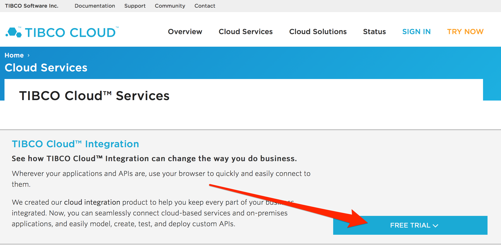

# Launch the workshop environment
Everything you need to get started with for this workshop will be hosted and operated in the TIBCO Connected Intelligence Cloud.

To get started, sign up for a free trial instance of TIBCO Cloud at [https://cloud.tibco.com/cloud-services](https://cloud.tibco.com/cloud-services) (tip: use ctrl+click (Windows) or command+click to open link in new window)

IMPORTANT - Select AWS option for provider

## Let's Move On

In the next lab, you'll focus on consuming sensor data from the SensorTag, creating a TIBCO integration application.

[--- next lab ---](connectsensortag.md)
