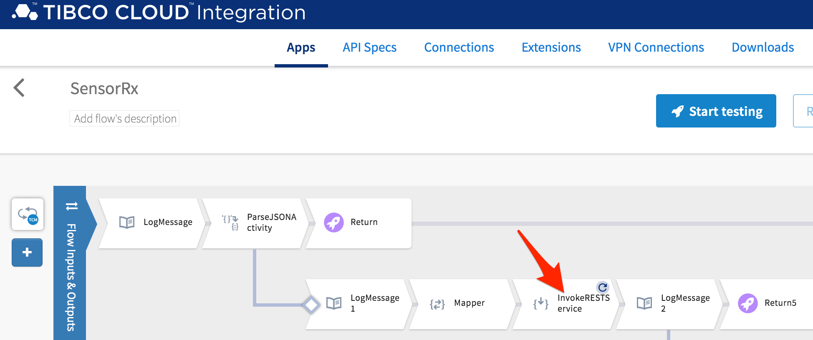
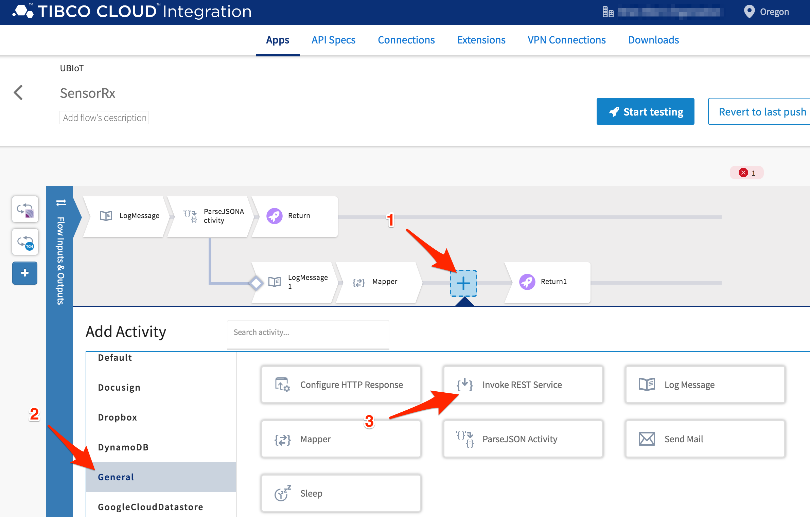
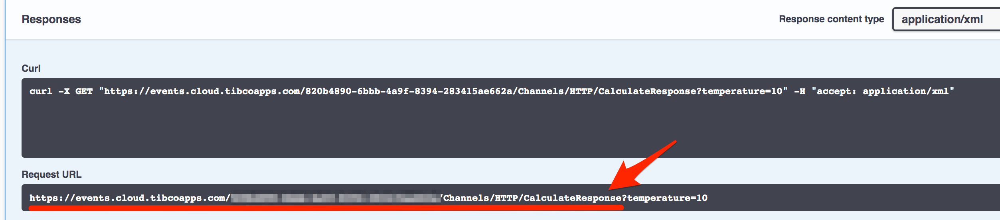
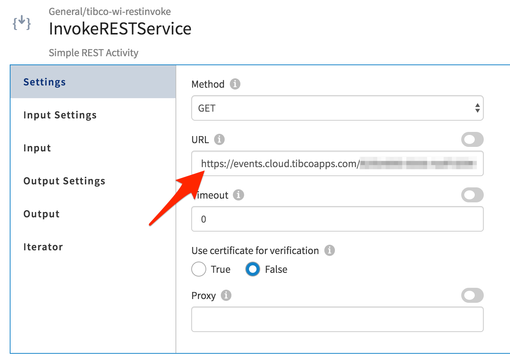
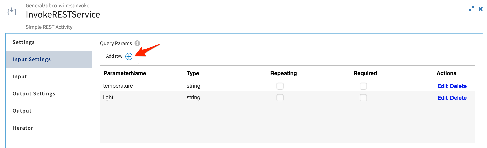
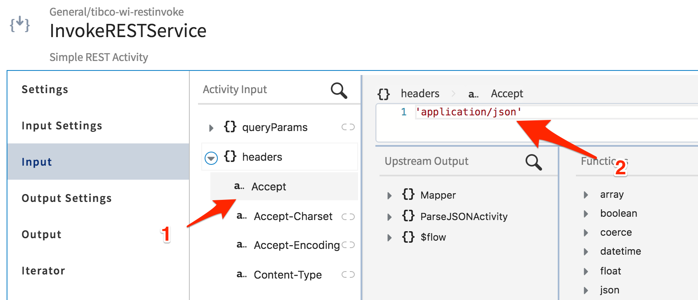
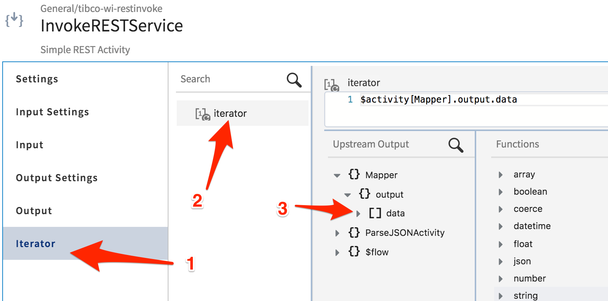
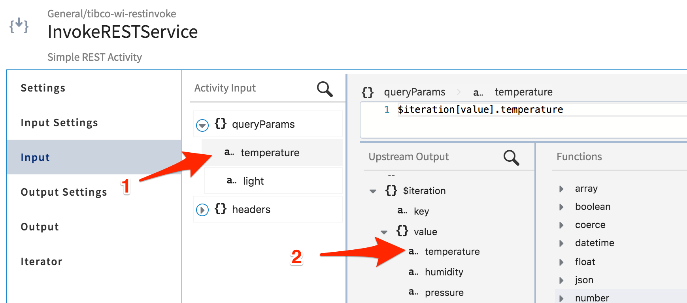
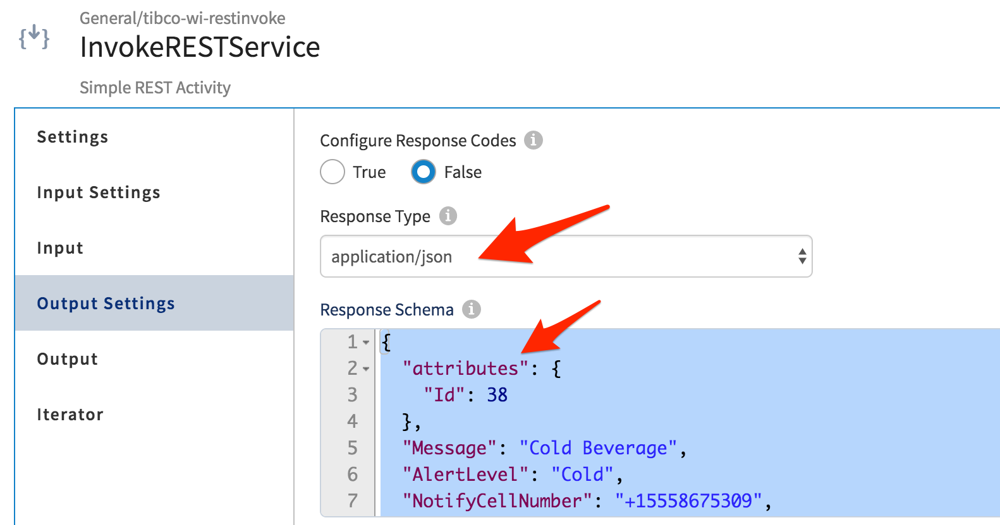

# Integrate SensorTag Data into Event Flow

## Overview

In the [previous section](rulestable.md), a rules table was implemented and a REST service endpoint was exposed.  Now you'll take the SensorTag data stream from the [first lab](connectsensortag.md) and direct it to call your Decision Table service API endpoint.

## Get Started

Start by signing into TIBCO Cloud and opening Flogo.  There are many ways to navigate to Flogo, but let's start with this:

1. Start at Welcome to your TIBCO Cloud
2. Select Integration
3. Select Flogo

## Add Decision Table Service to SensorTag Application

For this exercise, we are going to use the Flogo app created in lab 1, **UBIoT**.  We'll modify the REST activity **InvokeRESTService** to point to your TCE service endpoint.

1) Select **UBIoT** app
2) Select **SensorRx** flow
3) Select **InvokeRESTService** activity
4) Select **Settings** tab: Set the URL to the service URL of your TCE SensorTag Decision Table
5) Select **Input Settings** tab: Define query parameters for `temperature` and `light`
6) Select **Input** tab: Define the Accept parameter equal to `'application/json'`
7) Select **Iterator** tab: Set **iterator** value to the mapper activity data output
8) Select **Input** tab: Map `$iteration` values to query parameters
9) Select **Output** tab: Set the response schema

The following shows the steps above, layed out in more detail:


<!---->

`TIP: Open a second browser tab and go to the TIBCO Cloud Events Apps page.` [TIBCO Cloud Events](https://events.cloud.tibco.com/#!/) (use ctrl+click, launch in new tab/window). The easiest method to get the complete URL is to use the `Try it out` feature of the Swagger UI and copy the Request URL.  Copy everything up to the question mark, ?.  

1. Click on **2 Endpoints** and select **SensorTag - /swagger** URL
2. Click on blue **GET /Channels/HTTP/CalculateResponse** bar and select "Try it out"
3. Submit a query to the service and copy the Request URL (up to but not including the question mark,?)



Paste the URL into the URL field:



Add two query parameters; temperature and light.



On **Input** tab, modify the Headers, specifically set **Accept** = `'application/json'`



Now map the temperature and light values to the respective query parameters.  To do this, first set the **iteration** variable.

1) On **Iterator** tab, define the **Iterator** and map `$activity[Mapper].output.data` to the `iterator` input.
2) On **Input** tab, map the `$iteration` values to the respective **temperature** and **light** values to the respective query parameters. <br>
  **queryParams.temperature** = `$iteration[value].temperature`<br>
  **queryParams.light** = `$iteration[value].light`



Then back on the **Input** tab, map `$iteration[value].temperature` and `light` to the respective query parameters.



On **Output Settings**, set the response type to `application/json` and paste in the response schema below.

Response Schema:
```json
{
  "attributes": {
    "Id": 38
  },
  "Message": "Cold Beverage",
  "AlertLevel": "Cold",
  "NotifyCellNumber": "+15558675309",
  "NotifyPerson": "Buck Rogers"
}
```



From this point on, things can get exciting with activities you choose to implement next.  

Want to send a text message with Twilio as part of this flow?  **Careful, you'd be sending a text message once per second until the condition is cleared.**  What is needed is flow control.  That is a topic of conversation for the next section.

## Let's move on

In the next section we'll modify the application to handle flow control through branching and global variables in the application.

[--- next lab ---](ratelimit.md)
